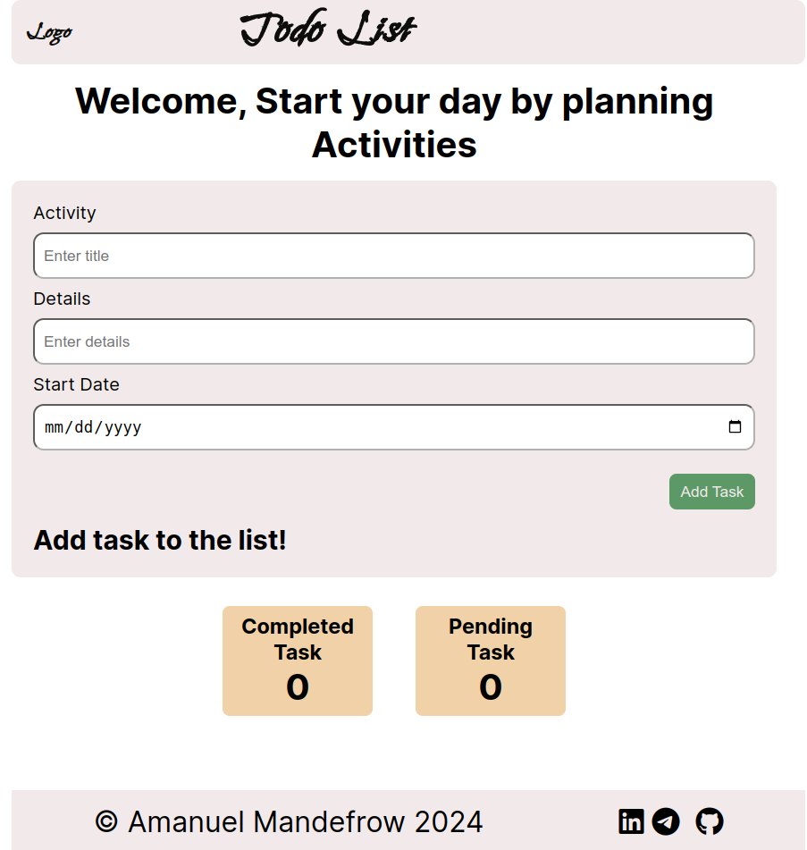
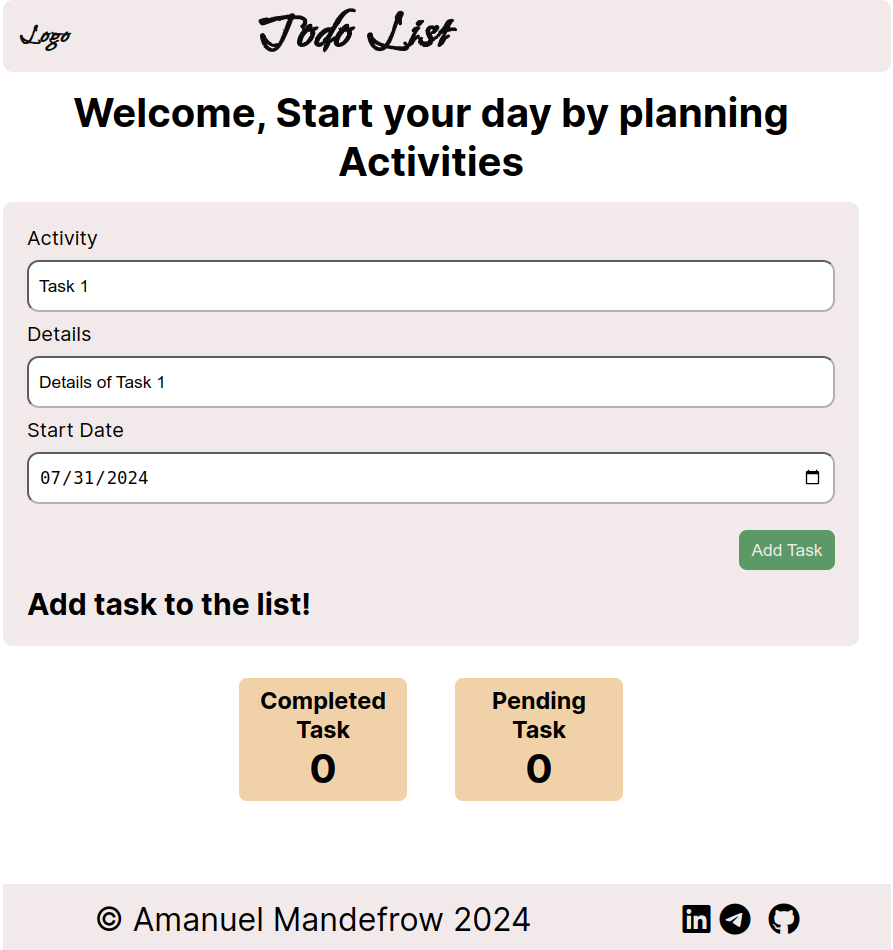
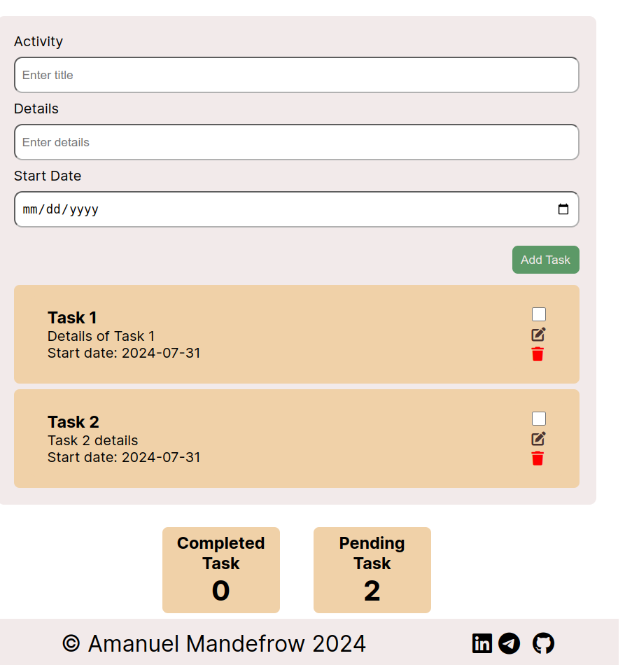

# Todo List Application

This project is a simple and elegant Todo List application that helps users plan and manage their daily activities. It allows users to add, edit, complete, and delete tasks. The application keeps track of the number of pending and completed tasks, providing a clear overview of the user's progress.

## Features

- Add new tasks with details and start date.
- Edit existing tasks.
- Mark tasks as complete, applying a strike-through effect.
- Delete tasks.
- Keeps track of completed and pending tasks.

## Screenshots

### Initial Page

Below is a screenshot of the initial page of the Todo List application, where no tasks have been added yet:



- **Header**: Welcomes the user with a motivational message.
- **Form**: Allows the user to input the task title, details, and start date.
- **Add Task Button**: Adds the task to the list.
- **Task List**: Displays a message prompting the user to add tasks.
- **Task Info**: Shows the count of completed and pending tasks, which are initially zero.
- **Footer**: Contains the author's name and social media icons.

### Adding a Task

Below is a screenshot showing the user entering a task title, details, and start date:



- **Form**: User enters the task title, details, and start date.
- **Add Task Button**: Clicking on this button will add the task to the Todo List.

### Tasks Added

Below is a screenshot showing the tasks after the user has added them to the Todo List:



- **Task List**: Displays the tasks added by the user with their details.
- **Task Actions**: Each task has a checkbox to mark it as complete, an edit button to modify the task, and a delete button to remove the task.
- **Task Info**: Shows the count of completed and pending tasks.

---

More screenshots and details will be added as we progress through the application functionalities.

## Installation

To run this project locally, follow these steps:

1. Clone the repository:
   ```bash
   git clone https://github.com/yourusername/todo-list.git
2. Navigate to the project directory:
    ```bash
    cd todo-list
3.Open the `index.html` file in your preferred web browser.

